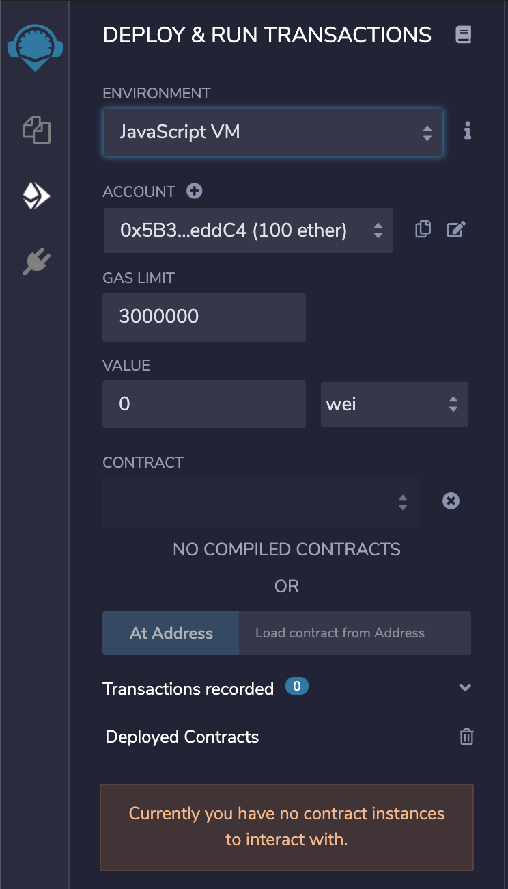

# Blockchain-Service - Installation Guide

---

[TOC]

## Requirement

* [Golang 1.15](https://golang.org/doc/install)
* [Ethereum 1.9.25](https://geth.ethereum.org/docs/install-and-build/installing-geth) // Install Ethereum, Geth, Abigen...
* Node Latest & Solcjs 0.8.0

### Linux

```shell
~ apt-get update -y && apt-get upgrade -y
~ apt-get install -y software-properties-common python3-gpg
~ add-apt-repository "deb http://ppa.launchpad.net/ethereum/ethereum/ubuntu xenial main"
~ apt-key adv --keyserver keyserver.ubuntu.com --recv-keys 0x2A518C819BE37D2C2031944D1C52189C923F6CA9
~ apt update -y && apt upgrade -y
~ apt-get install -y ethereum
~ geth version
Geth
Version: 1.9.25...
Architecture: amd64
Go Version: go1.15.6
Operating System: linux
~ abigen --version
abigen version 1.9.25...
~ apt-get install -y curl ⚠️ Optional ⚠️
~ curl https://dl.google.com/go/go1.15.8.linux-amd64.tar.gz --output golang-1.15.tar.gz
~ tar -C /usr/local -xzf golang-1.15.tar.gz
~ export PATH=$PATH:/usr/local/go/bin
~ go version
go version go1.15.8 linux/amd64
~ apt-get install nodejs
~ npm install -g solc
~ solcjs --version
0.8.0+commit.c7dfd78e.Emscripten.clang
```

### MacOS

```shell
~ brew tap ethereum/ethereum
~ brew install ethereum
~ brew install golang
~ brew install nodejs
~ npm intall -g solc
```

## Keystore

A Keystore is a file containing an encrypted eth account.

We need at least 4 keystore files, 1 to certify diplomas and 3 others to write in the blockchain.

⚠️   **Be careful, you must never lose the file that allows you to sign the diplomas. **  ⚠️

### Creation of a Keystore file

```shell
~ geth account new
INFO [07-16|15:51:50.836] Maximum peer count                       ETH=50 LES=0 total=50
Your new account is locked with a password. Please give a password. Do not forget this password.
Password: [password]
Repeat password: [password]

Your new key was generated

Public address of the key:   [public address]
Path of the secret key file: ~/Library/Ethereum/keystore/[Nom du fichier]

- You can share your public address with anyone. Others need it to interact with you.
- You must NEVER share the secret key with anyone! The key controls access to your funds!
- You must BACKUP your key file! Without the key, it's impossible to access account funds!
- You must REMEMBER your password! Without the password, it's impossible to decrypt the key!
```

### Keystore to certify diplomas

#### Step 1 - Creates a keystore file

#### Step 2 - Retrieve the `public address` of the created account.

#### Step 3 - Modify the variable `ftPubAddress` in the smart contract.

```js
pragma solidity >=0.8.0;

contract	FtDiploma {

	string public constant name = "42 Alumni";
	string public constant symbol = "42A";
	string public constant linkOfRepo = "github.com/42School/blockchain-service";
	address public constant ftPubAddress = [public address]

  [...]
}
```

#### Step 4 - Compile the contract.

```shell
~ make update-contract
```

#### Step 5 - Adding the file in the repo and the env

```shell
~ mdkir blockchain-service/config/keystore-sign
~ mv [filename] blockchain-service/config/keystore-sign
~ vi blockchain-service/config/blockchain-service.env
KEY_PASSWD="[password of keystore]"
KEYSTORE_PATH_SIGN="/blockchain-service/config/keystore-sign"
```

### Keystore to write in Ethereum

#### Step 1 - Creates a keystores files (minimum 3)

#### Step 2 - Creation of the `accounts.csv` file

```shell
~ touch blockchain-service/config/accounts.csv
```

```csv
# file name, password
[filename], [password of keystore]
[filename], [password of keystore]
[filename], [password of keystore]
```

#### Step 3 - Adding the file in the repo and the env

```shell
~ mkdir blockchain-service/config/keystore
~ mv [filename] blockchain-service/config/keystore
~ mv [filename] blockchain-service/config/keystore
~ mv [filename] blockchain-service/config/keystore
~ vi blockchain-service/config/blockchain-service.env
KEYSTORE_PATH="blockchain-service/config/keystore"
ACCOUNTS_FILE="blockchain-service/config/accounts.csv"
```

## Purchase of Ethereum

### Step 1 - Buy Ethereum

#### Website

- [Coinbase](https://www.coinbase.com/)
- [Binance](https://www.binance.com)

#### Application

- [Ledger Live](https://www.ledger.com/ledger-live)
- [MetaMask](https://metamask.io/)

### Step 2 - Transfer the Eth on the keystores

#### How to verify ?

Enter the transaction hash in `etherscan` and check the status of the transaction.

- [Etherscan](https://etherscan.io)

## Deployment on Ethereum

### Requirement

- [Remix](https://remix.ethereum.org/)
- [MetaMask](https://metamask.io/)

### Step 1 - Copy the smart-contract in Remix

<h3 align="center">

</h3>

### Step 2 - Compile the smart-contract in Remix

<h3 align="center">

</h3>

### Step 3 - Import 1 Keystore in Metamask

<h3 align="center">


</h3>

### Step 4 -  Deploy the smart-contract

<h3 align="center">



</h3>

### Step 5 - Verify with EtherScan

Enter the transaction hash in [Etherscan](https://etherscan.io) and check the status of the transaction.

### Step 6 - Adding address of contract in env

```shell
~ vi blockchain-service/config/blockchain-service.env
CONTRACT_ADDRESS="0x29A5C09219A5c71A81d26922D708E472677F4548"
```

## Environment

## Run

